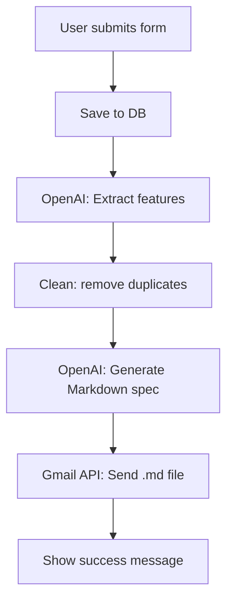

```markdown
# Project Documentation

A **one-page Django app** that turns messy project ideas into clean, professional Markdown specs — and emails them instantly.

---

## What It Does

1. User fills a form:  
   - Project name  
   - Raw feature description (any format)  
   - Their email  
2. App:  
   - Saves to DB  
   - Uses OpenAI to **extract clean features**  
   - **Cleans** duplicates & noise  
   - **Generates** full Markdown spec (roadmap, priorities, folder structure, tools)  
   - **Emails** it as `.md` file via Gmail API  
3. User sees: **"Done! Check your email."**

No login. No accounts. One click.

---

## Tech Stack

| Part | Tool |
|------|------|
| Backend | Django |
| Frontend | Tailwind CSS + Django templates |
| AI | OpenAI `gpt-4o-mini` |
| Email | Gmail API (OAuth2) |
| Secrets | `.env` |
| DB | SQLite (dev) / PostgreSQL (prod) |
| Deploy | Render / Railway / Any Python host |

---

## Folder Structure

```
myproject/
├── core/                     # Core logic
│   ├── models.py             # DB model
│   ├── forms.py              # Styled form
│   ├── views.py              # Main flow
│   ├── urls.py               # Single route
│   └── utils/
│       ├── feature_extractor.py   # AI: extract features
│       ├── clean_features.py       # Remove junk
│       ├── markdown_generator.py   # Build full spec
│       └── email_utils.py          # Send email
│       └── token.json              # Gmail OAuth token
├── templates/
│   └── index.html            # Only page
├── config/
│   ├── settings.py           # Django config
│   └── urls.py               # Root routing
├── .env                      # OpenAI key
├── generate_token.py         # One-time script (see below)
└── manage.py
```

---

## Setup & Run

### 1. Clone & Install
```bash
git clone <your-repo>
cd myproject
python -m venv venv
source venv/bin/activate  # Windows: venv\Scripts\activate
pip install -r requirements.txt
```

### 2. `.env` File
```env
OPENAI_API_KEY=sk-your-key-here
```

### 3. Gmail OAuth2 Setup (One-Time)

> **Never commit `token.json` or `credentials.json`**

#### Step-by-Step:

1. Go to [Google Cloud Console](https://console.cloud.google.com/)
2. Create project → **Enable Gmail API**
3. **Credentials** → **Create OAuth Client ID** → **Desktop app**
4. Download → save as `credentials.json` in **project root**
5. Run this script:

```python
# generate_token.py
from google_auth_oauthlib.flow import InstalledAppFlow

SCOPES = ['https://www.googleapis.com/auth/gmail.send']

def main():
    flow = InstalledAppFlow.from_client_secrets_file('credentials.json', SCOPES)
    creds = flow.run_local_server(port=8080)
    with open('core/utils/token.json', 'w') as f:
        f.write(creds.to_json())
    print("token.json saved to core/utils/")

if __name__ == '__main__':
    main()
```

```bash
python generate_token.py
```

- Browser opens → allow access  
- `token.json` → saved in `core/utils/`

**Delete `credentials.json` after.**

###  underlines4. Migrate & Run
```bash
python manage.py makemigrations
python manage.py migrate
python manage.py runserver
```

Visit: `http://localhost:8000`

---

## How It Works



---

